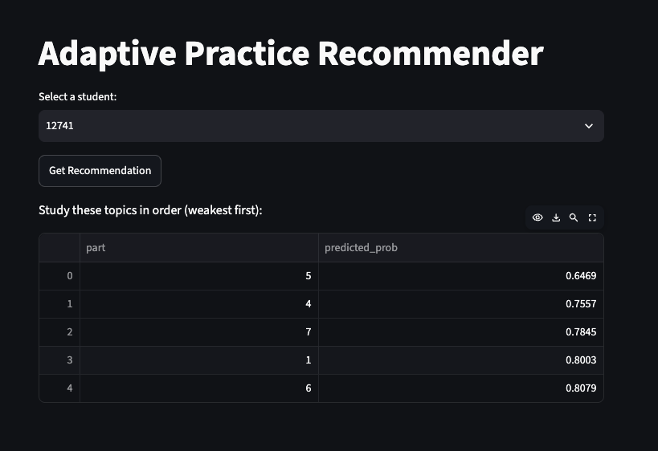

# 📚 Adaptive Practice Recommender: Knowledge Tracing for Students

A machine learning system that predicts if a student will answer the next question correctly, then recommends which topics to study next, weakest first. Trained on real student practice data from the RIIID / EdNet dataset.

## 🧠 Machine Learning Pipeline

### Architecture Overview

The system works in four stages:

1. **Data Cleaning** - Load 1 million student interactions and keep only question attempts (lectures removed)
2. **Feature Engineering** - Build 3 features from each student's practice history
3. **Model Training** - Compare 4 models and pick the best one (XGBoost)
4. **Recommendation** - Predict the chance of a correct answer for each topic, then sort topics from weakest to strongest

### Technical Implementation

- **No Future Peeking**: Features use only the student's attempts *before* the current question, so the model never sees the answer it is predicting
- **Feature Scaling**: Features are scaled with `StandardScaler`, which fixed a model that was only guessing the majority class
- **Latest Snapshot**: A small summary table stores each student's latest state per topic, so the API stays fast

## 🔧 Feature Engineering

| Feature | What it means |
|---|---|
| `topic_accuracy` | How often the student got this topic right so far |
| `time_since_last_attempt` | How long since the student last practiced this topic (memory fades over time) |
| `ques_avg_accuracy` | How hard the question is, based on all students' answers |

**Known limitation**: `ques_avg_accuracy` is averaged over the whole dataset, so it uses a little future information. This is a common shortcut for question difficulty, and it is noted on purpose.

## 📊 Models Compared

| Model | Accuracy |
|---|---|
| Baseline (always guess "correct") | 65.10% |
| Logistic Regression (unscaled) | 65.10% |
| Logistic Regression (scaled) | 71.01% |
| Random Forest | 69.63% |
| **XGBoost (final model)** | **71.75%** |

### Beyond accuracy (XGBoost, 196,019 test rows)

Accuracy alone can hide problems when classes are imbalanced (65% correct / 35% wrong), so the model is also checked per class.

| Metric | Value |
|---|---|
| ROC-AUC | 0.758 |
| Log loss | 0.546 |
| Macro F1 | 0.661 |
| Weighted F1 | 0.703 |

| Class | Precision | Recall | F1 |
|---|---|---|---|
| 0 (answered wrong) | 0.636 | 0.445 | 0.523 |
| 1 (answered correctly) | 0.744 | 0.864 | 0.799 |

**What this means:** ROC-AUC (0.758) is the most relevant metric here, because the recommender *ranks* topics by predicted probability rather than making a yes/no call. The model is much better at spotting correct answers (recall 0.86) than wrong ones (recall 0.45) — it leans toward the majority class. Improving recall on wrong answers (for example with `scale_pos_weight` or a tuned threshold) is a planned next step.

**Note:** XGBoost is trained on raw (unscaled) features — trees don't need scaling, and the API sends raw values, so training and serving use the same format.

## 🎬 Demo

**Live app:** https://adaptive-practice-recommender-2vlca9ytfpgsww5ubefrm9.streamlit.app



*Pick a student from the dropdown, click "Get Recommendation", and see their topics ranked from weakest to strongest.*

> The backend runs on AWS EC2 only when needed (to keep the cost at $0), so the live app may not return results when the server is stopped.

**Example output for student 115:**

| Topic (part) | Chance of a correct answer |
|---|---|
| 3 | 16% ← study this first |
| 4 | 46% |
| 2 | 61% |
| 5 | 75% |
| 1 | 99% |

## 🛠️ Technology Stack

**Machine Learning**
- Python, Pandas
- scikit-learn
- XGBoost
- joblib

**Web Application & API**
- FastAPI
- Uvicorn
- Streamlit
- Requests

**Deployment**
- Docker
- AWS EC2
- Streamlit Community Cloud

## 🎮 Features

- **Weakest Topic First**: Topics are ranked by the predicted chance of a correct answer
- **Student History Aware**: Uses each student's own accuracy and practice timing
- **REST API**: `GET /recommend/{user_id}` returns the ranked topics as JSON
- **Separate Frontend and Backend**: The UI calls the API over HTTP, so each part can be deployed on its own
- **Zero-Cost Deployment**: EC2 is started only for demos, with a zero-spend budget alert as a safety net

## 📁 Project Structure

```
├── explore_data.ipynb          # Data cleaning, features, model training
├── model_xgb.pkl               # Trained XGBoost model
├── student_topic_summary.csv   # Latest features per student per topic
├── main.py                     # FastAPI backend (/recommend/{user_id})
├── app.py                      # Streamlit frontend
├── Dockerfile                  # Container for the backend
└── requirements.txt            # Python dependencies
```

The raw Kaggle files (`train.csv`, `questions.csv`) are not in the repo because of their size. Download them from the [Kaggle Riiid Answer Correctness Prediction](https://www.kaggle.com/competitions/riiid-test-answer-prediction) page.

## 🏆 Technical Achievements

- **Real Data at Scale**: Worked with a 1-million-row sample of a 100M+ row real dataset
- **Leakage-Safe Features**: Rolling features built only from past attempts
- **Evidence-Based Model Choice**: 4 models tested on the same held-out data before picking XGBoost
- **Smaller Docker Image**: Switched to `xgboost-cpu` to drop a 342 MB unused GPU package, which fixed a "no space left" error on EC2
- **Full Product**: Notebook → API → web app → Docker → cloud, all working end to end

## 🔮 Future Improvements

- Run the pipeline on the full 100M+ rows with chunked processing or Dask
- Compute question difficulty from training data only, to remove the small leakage
- Show a friendly message when the backend is offline
- Add HTTPS and authentication to the API